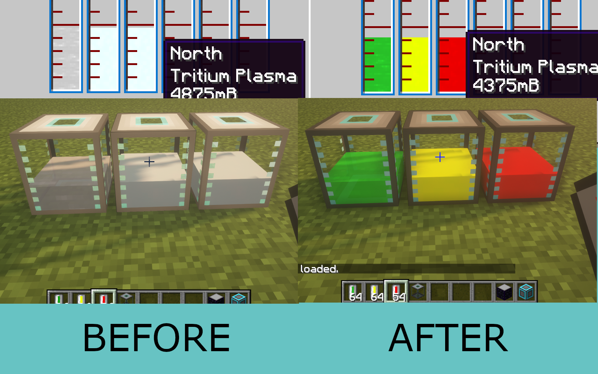

# ExtraCellsRenderFix

This is a mod that fixes various rendering issues in ExtraCells 2 (1.7.10)

The version is tested against ExtraCells-1.7.10-2.3.14b200. The mod uses
ASM patching so use with caution.

This mod is client-only. You are wasting server resources if you install it on the server.

## Fixes:
- Fixed some GregTech 5 fluids are displayed colorless both in world (Certus Tank) and GUI
- Fixed in some GUI, hovering over slots causes NEI to have weird item lighting
- Fixed filled Certus Tanks are (sometimes) not displayed correctly in inventory
- Fixed Certus Tank rendered in the world sometimes flickers or has the wrong lighting.
